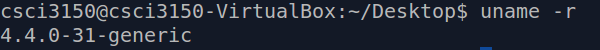

# Check current kernel version

Before we start the job, we will first check the current kernel version of our VM. Open the terminal and type:
```
$ uname -r
```
The output shows the current kernel version is `4.4.0`

