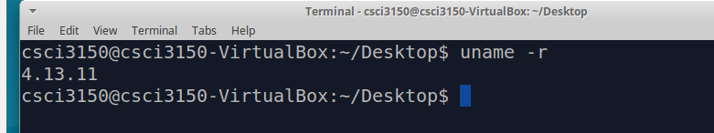
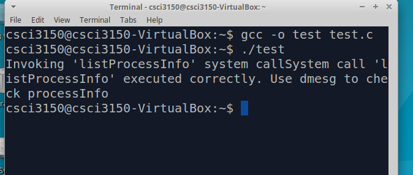
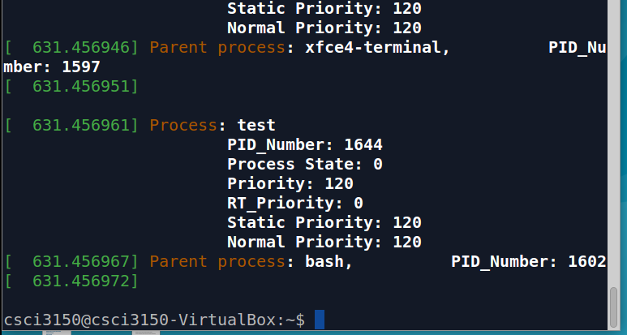

# Testing the system call 


## Check new kernel version

Use `uname -r` to check the new kernel version. As we can see, the new version is 4.13.11



## Test the system call

To test the system call write a simple ‘**test.c**’ function (it can be placed in any directory) as follows:
```
#include <stdio.h>
#include <linux/kernel.h>
#include <sys/syscall.h>
#include <unistd.h>
int main()
{  
    printf("Invoking 'listProcessInfo' system call");
         
    long int ret_status = syscall(385); // 385 is the syscall number
         
    if(ret_status == 0) 
         printf("System call 'listProcessInfo' executed correctly. Use dmesg to check processInfo\n");
    
    else 
         printf("System call 'listProcessInfo' did not execute as expected\n");
          
     return 0;
}
```
Compile and execute this program. If it runs successfully, then, it should give the corresponding prompt and you can now use `dmesg` to check the kernel log and actually verify if the process information has been logged.


```
dmesg   ### Check the kernel log to which we print the process info
```


And with that, we have successfully implemented a working system call that actually uses one of the internal kernel data structures!

_Note: The system call implemented does not take care of privilege checks, does not return any error codes on failure and does not do anything particularly useful for the user. So, it is actually far from being a well-designed system call! But, you have finished the first step into Linux kernel_


